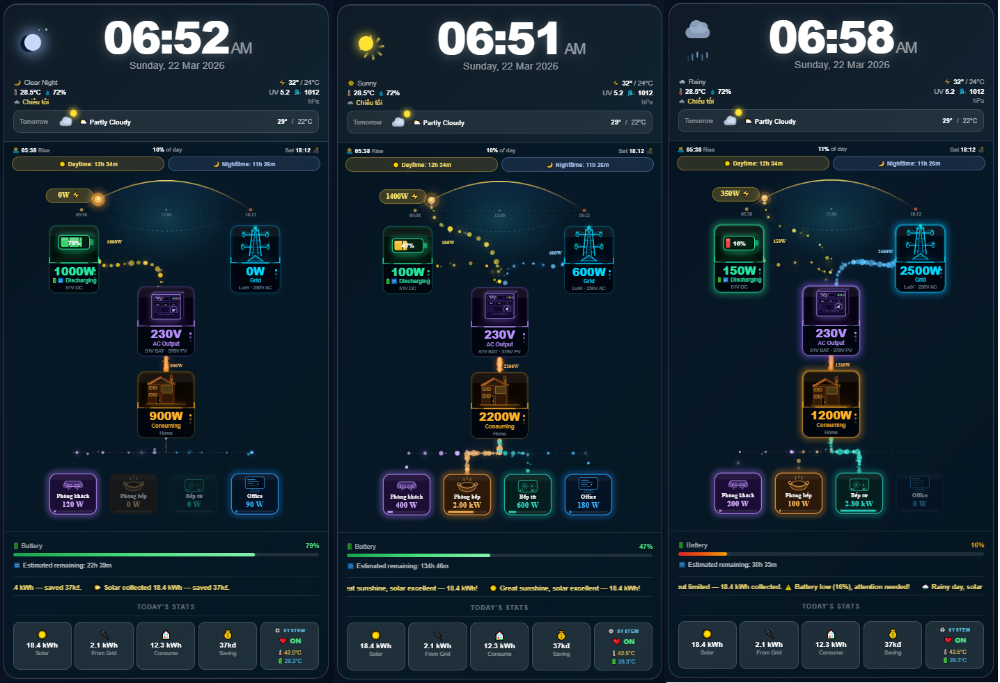
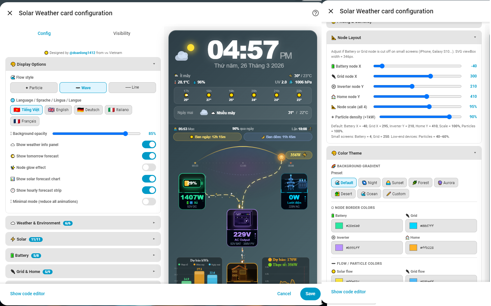

# ☀️ Solar Weather Card

[](https://github.com/hacs/integration)


> 🇻🇳 **Phiên bản tiếng Việt:** [README.md](README.md)

A custom Home Assistant card that displays your complete solar energy system — Solar, Battery, Grid, home consumption — alongside animated weather, a real-time clock, and a live sun/moon arc.

**No extra plugins required. Works standalone, fully configurable through the built-in UI editor.**

---

## 📸 Preview



---

## ✨ Features (v1.5.1)

### 🎨 Display & Interface
- 🕐 **Live clock & date**, auto-updates every 30 seconds — weather icon always visible even when info panel is hidden
- 🌤️ **Animated CSS weather icons** — rotating sun, falling rain, lightning flash, drifting fog, blowing wind
- 🌍 **Today's weather + tomorrow's forecast** (each toggleable independently)
- 🌅 **Sun / moon arc** moves in real time based on sunrise/sunset
- ☀️ **Sun heartbeat** — pulse speed and glow scale with solar output
- 🌈 **Dynamic sky aura** — colour shifts from dawn through midday to dusk

### ⚡ Energy Flow (3 styles)
- **✦ Particle** — bubbles travel along Bézier curves with glow and highlight sparkles
- **〰️ Wave** — sine wave + dust particles + bright dots (new in v1.5)
- **── Line** — animated dashed stroke

### 🏗️ Node Cards (Battery, Inverter, Grid, Home)
- Heartbeat border pulse when energy flows (toggleable)
- Detailed 3D icons: battery, inverter with spinning fan, lattice tower + transformer, 3D house

### 🔋 Battery
- Colour-coded bar: 🟢 green (>20%) → 🟡 amber (10–20%) → 🔴 red (≤10%)
- **Charge / discharge ETA** — supports Ah sensors (LuxPower) × live voltage

### 📊 Stats & System
- 5-cell stats bar: Solar / From Grid / Consume / Saving / System
- **Custom electricity pricing** + **custom currency symbol**
- Scrolling ticker with weather commentary and battery status

### 🎛️ Config Editor
- **Accordion sections** — entities grouped by category, expand/collapse each section
- **ha-entity-picker** — native HA dropdown, auto-filtered by entity domain
- **5 languages**: 🇻🇳 Tiếng Việt / 🇬🇧 English / 🇩🇪 Deutsch / 🇮🇹 Italiano / 🇫🇷 Français

---

## 📦 Installation

### Option 1 — HACS (recommended)

**Step 1:** Add Custom Repository to HACS:

[](https://my.home-assistant.io/redirect/hacs_repository/?owner=doanlong1412&repository=solar-weather-card&category=Dashboard)

> If the button doesn't work, add manually:
> **HACS → Frontend → ⋮ → Custom repositories**
> → URL: `https://github.com/doanlong1412/solar-weather-card` → Category: **Frontend** → Add

**Step 2:** Search for **Solar Weather Card** → **Install**

**Step 3:** Hard-reload your browser (Ctrl+Shift+R)

---

### Option 2 — Manual

1. Download [`solar-weather-card.js`](https://github.com/doanlong1412/solar-weather-card/releases/latest)
2. Copy to `/config/www/solar-weather-card.js`
3. Go to **Settings → Dashboards → Resources** → **Add resource**:
   ```
   URL:  /local/solar-weather-card.js
   Type: JavaScript module
   ```
4. Hard-reload your browser (Ctrl+Shift+R)

---

## ⚙️ Card Configuration

### Step 1 — Add the card to your dashboard

```yaml
type: custom:solar-weather-card
```

After adding the card, click **✏️ Edit** to open the Config Editor.

### Step 2 — Config Editor overview



The Config Editor is divided into **accordion sections** — click any header to expand/collapse:

| Section | Contents |
|---------|---------|
| 🎨 **Display Options** | Flow style, language, opacity, display toggles |
| ☁️ **Weather & Environment** | Weather entity, temperature, humidity, UV, pressure, rain forecast |
| ⚡ **Solar** | Array power and voltage sensors |
| 🔋 **Battery** | SOC, charge/discharge flow, voltage, capacity |
| 🔌 **Grid & Home** | Grid flow, AC voltage, home consumption |
| ⚙️ **System & Stats** | Inverter status, temperatures |
| 💰 **Pricing & Currency** | Electricity pricing tiers, currency symbol |

> 💡 **Badge numbers** (e.g. `6/6`) on each section show how many entities are configured.

---

### Display options

| Config key | Values | Default | Description |
|---|---|---|---|
| `flow_style` | `particle` / `wave` / `line` | `particle` | Energy flow animation style |
| `language` | `vi` / `en` / `de` / `it` / `fr` | `vi` | Display language |
| `background_opacity` | `0` – `100` | `45` | Card background opacity (%) |
| `show_weather_info` | `true` / `false` | `true` | Show/hide full weather info panel |
| `show_tomorrow` | `true` / `false` | `true` | Show/hide tomorrow's forecast |
| `show_node_glow` | `true` / `false` | `true` | Enable/disable node glow effect |
| `currency` | any symbol | `đ` | Currency symbol for savings display |
| `pricing_tiers` | see below | Vietnam EVN | Custom electricity pricing tiers |

---

### Custom electricity pricing

Leave `pricing_tiers` empty to use the built-in **Vietnam EVN tiered pricing**.

Format: `limit_kWh:rate` comma-separated. Use `∞` or `inf` for the final tier.

```
# Example — German electricity (€/kWh):
50:0.25,100:0.28,∞:0.32

# Example — flat rate ($/kWh):
∞:0.15
```

---

### Available entities

#### ☁️ Weather & Environment

| Config key | Description | Required |
|---|---|:---:|
| `weather_entity` | `weather.xxx` | ✅ |
| `temperature_entity` | Outdoor temperature sensor (°C) | ✅ |
| `humidity_entity` | Outdoor humidity sensor (%) | ✅ |
| `pressure_entity` | Atmospheric pressure sensor (hPa) | |
| `uv_entity` | UV index sensor | |
| `rain_entity` | Rain forecast text sensor | |

#### ⚡ Solar

| Config key | Description | Required |
|---|---|:---:|
| `solar_pv1_entity` | Array 1 output power (W) | ✅ |
| `solar_pv2_entity` | Array 2 output power (W) | |
| `solar_pv1_voltage_entity` | Array 1 DC voltage (V) | |
| `solar_pv2_voltage_entity` | Array 2 DC voltage (V) | |
| `solar_today_entity` | Solar generation today (kWh) | |

#### 🔋 Battery

| Config key | Description | Required |
|---|---|:---:|
| `battery_soc_entity` | State of charge (%) | ✅ |
| `battery_flow_entity` | Charge/discharge flow (W, + charge / − discharge) | ✅ |
| `battery_voltage_entity` | DC voltage (V) | |
| `battery_capacity_entity` | Capacity sensor (Ah) — LuxPower returns Ah | |
| `battery_capacity_wh` | Manual capacity (Wh) — e.g. `26880` | |
| `battery_temp_entity` | BMS temperature (°C) | |

> 💡 **ETA priority:** Manual Wh → Sensor Ah × Voltage → Default 560 Ah × 48 V

#### 🔌 Grid & Home

| Config key | Description | Required |
|---|---|:---:|
| `grid_flow_entity` | Grid flow (W, + export / − import) | ✅ |
| `home_consumption_entity` | Total household load (W) | ✅ |
| `grid_voltage_entity` | AC voltage (V) | |
| `grid_today_entity` | Grid energy imported today (kWh) | |
| `consumption_today_entity` | Total consumption today (kWh) | |
| `inverter_switch_entity` | Inverter switch entity (grid-direct mode) | |
| `grid_direct_entity` | Grid-direct power when inverter is off (W) | |

#### ⚙️ System & Stats

| Config key | Description | Required |
|---|---|:---:|
| `inverter_status_entity` | Status: Normal / online / OFF | |
| `inverter_temp_entity` | Inverter temperature (°C) | |

---

### Full YAML example (LuxPower + Seplos BMS)

```yaml
type: custom:solar-weather-card
flow_style: wave
language: en
background_opacity: 45
show_weather_info: true
show_tomorrow: true
show_node_glow: true
currency: đ

weather_entity: weather.forecast_home
temperature_entity: sensor.outdoor_temperature
humidity_entity: sensor.outdoor_humidity
pressure_entity: sensor.outdoor_pressure
uv_entity: sensor.uv_index
rain_entity: sensor.rain_forecast

solar_pv1_entity: sensor.lux_solar_output_array_1_live
solar_pv2_entity: sensor.lux_solar_output_array_2_live
solar_pv1_voltage_entity: sensor.lux_solar_voltage_array_1_live
solar_pv2_voltage_entity: sensor.lux_solar_voltage_array_2_live

battery_soc_entity: sensor.lux_battery
battery_flow_entity: sensor.lux_battery_flow_live
battery_voltage_entity: sensor.lux_battery_voltage_live
battery_capacity_entity: sensor.lux_battery_capacity

grid_flow_entity: sensor.lux_grid_flow_live
grid_voltage_entity: sensor.lux_grid_voltage_live
grid_today_entity: sensor.lux_power_from_grid_daily

home_consumption_entity: sensor.lux_home_consumption_live
solar_today_entity: sensor.solar_today_kwh
consumption_today_entity: sensor.consumption_today_kwh

inverter_status_entity: sensor.luxpower
inverter_switch_entity: switch.inverter_lux_inverter
grid_direct_entity: sensor.grid_direct_power
inverter_temp_entity: sensor.lux_internal_temperature_live
battery_temp_entity: sensor.bms_temperature
```

---

## 🔋 Default Vietnam EVN Pricing (2024)

| Tier | Range | Rate |
|------|-------|------|
| 1 | 0 – 50 kWh | 1,984 ₫/kWh |
| 2 | 51 – 100 kWh | 2,050 ₫/kWh |
| 3 | 101 – 200 kWh | 2,380 ₫/kWh |
| 4 | 201 – 300 kWh | 2,998 ₫/kWh |
| 5 | 301 – 400 kWh | 3,350 ₫/kWh |
| 6 | 400+ kWh | 3,460 ₫/kWh |

---

## 🖥️ Compatibility

| | |
|---|---|
| Home Assistant | 2023.1+ |
| Lovelace | Default & custom dashboards |
| Devices | Mobile & Desktop |
| Dependencies | None |
| Browsers | Chrome, Firefox, Safari, Edge |

---

## 📋 Changelog

### v1.5.1
- 🌤️ Weather icon always visible alongside clock even when `show_weather_info` is off
- 🌡️ Fixed outdoor temperature/humidity reading from sensor entities
- 📅 Tomorrow forecast now prioritises `sensor.tomorrow_raw_hourly` (Tomorrow.io), falls back to `wfc[1]`
- 🌡️ Fixed today's forecast hi/lo reading from `wfc[0]`

### v1.5.0
- 〰️ New flow style: **Wave** — sine wave + dust particles + bright dots
- ✨ Toggle to enable/disable node glow effect (`show_node_glow`)
- 🏷️ Removed power labels alongside flow paths
- 🔽 **ha-entity-picker** — native HA entity dropdown, filtered by domain
- 📁 **Accordion sections** in Config Editor
- 🇫🇷 Added Français — 5 languages total
- 🏳️ Real country flag images in language selector

### v1.4.1
- 🗼 New grid icon: lattice tower + separate transformer
- ⚡ Type-based flowLevel for solar/battery/grid/home
- 💰 Custom pricing tiers + currency symbol
- 🌤️ Toggle for tomorrow forecast

### v1.4.0
- ✨ Completely new node cards: heartbeat border, hex grid, detailed 3D icons
- ☀️ Sun heartbeat scales with solar output
- 🌈 Dynamic sky aura throughout the day
- 📊 5-cell stats bar + scrolling ticker

### v1.0.0 – v1.3.x
- Foundation: standalone card, Visual Config Editor, particle flow, animated weather icons

---

## 📄 License

MIT License — free to use, modify, and distribute.
If you find this useful, please ⭐ **star the repo**!

---

## 🙏 Credits

Designed and developed by **[@doanlong1412](https://github.com/doanlong1412)** from 🇻🇳 Vietnam.
